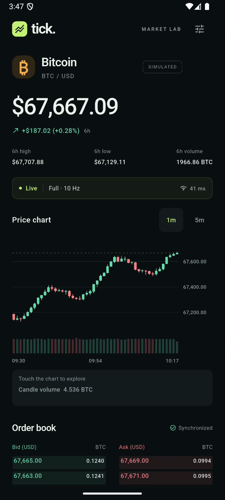
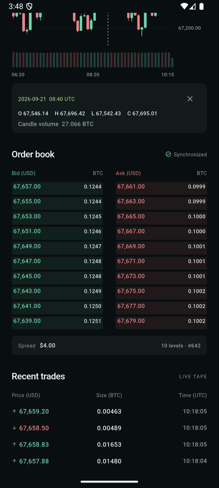
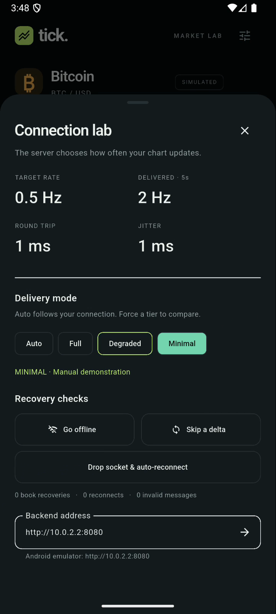
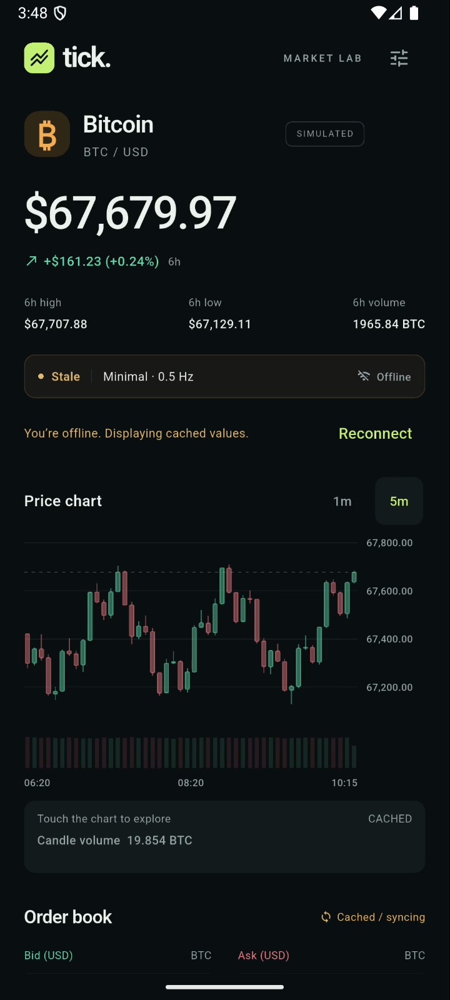

# Verification

Verified locally on **21 September 2026** with Flutter 3.35.7, Dart 3.9.2, Node.js 22.17.0, and an Android API 36 ARM64 emulator.

| Check | Result |
| --- | --- |
| Node architecture, domain, application, and HTTP/WebSocket tests | **20 passed** |
| Flutter architecture, domain, data, Bloc, and widget tests | **36 passed** |
| Android end-to-end integration test against the Node backend | **1 passed** |
| Flutter static analysis | **No issues found** |
| Backend dependency audit (`npm audit --omit=dev`) | **0 reported vulnerabilities** |
| Android release APK compilation and install | **Passed** |
| Android Bitcoin deep link | **Opened the release app on emulator** |
| Android live screen / chart inspection / interval change | **Passed on emulator** |
| Per-connection full, degraded, minimal overrides | **Passed on emulator and backend tests** |
| Dropped book delta → fresh snapshot → synchronized book | **Passed on emulator and pure Dart tests** |
| Manual offline → cached/stale values → reconnect | **Passed on emulator** |
| Server socket close → automatic reconnect and resubscribe | **Passed on emulator** |
| Foreground/background cleanup and stale late responses | **Passed in Bloc tests** |
| iOS / physical-device / store signing validation | **Not performed** |
| 250 simultaneous mixed-tier clients, five-second localhost smoke check | **No observed book gaps or client errors** |
| Narrow phone / phone / tablet layouts and alternative market identity | **Passed at 320 / 360 / 800 logical-pixel widths** |
| GitHub Actions | Workflow included; not run remotely before push |

## Recorded demonstration

[demo.mp4](demo.mp4), recorded on 21 September 2026 after the chart package refactor and before the Bloc migration, is a 74-second Android screen recording, 720 × 1600, H.264. It shows the actual Flutter app connected to the local Node server. The integration test drives the interactions. The same visual flow has also been verified end to end with Bloc. The recording is trimmed to remove build/startup and post-test idle time; it is not a mockup.

Approximate chapters:

- 0–6s: live one-minute chart and price.
- 6–13s: touch/drag candle inspector and OHLC values.
- 13–17s: five-minute interval selection and history/live merge.
- 17–24s: ten-level order book and recent trade tape.
- 24–49s: connection metrics, forced full/degraded/minimal delivery, and book-gap recovery.
- 49–58s: offline cached chart and stale labels.
- 58–64s: manual reconnect.
- 64–69s: Auto mode and a server-induced disconnect/reconnect.
- 69–74s: recovered live chart.

Actual chart-update rates use a rolling five-second window and temporarily include messages from the preceding tier after an override. This explains intermediate effective rates in the recording.

## Reproduce

```sh
./scripts/start-backend.sh
# In another terminal:
./scripts/check.sh
cd mobile
flutter test integration_test/market_flow_test.dart -d <device-id>
```

For a paced recording, add `--dart-define=RECORD_DEMO=true`. The test prints `DEMO_READY` before the flow and `DEMO_COMPLETE` when all assertions pass.

Architecture tests enforce inward dependency rules in both projects. Backend application tests inject in-memory channels and explicit times; Flutter data tests verify REST mapping, typed socket events, malformed frames, and outbound commands. See [the architecture guide](ARCHITECTURE.md).

The deterministic aggregate test independently folds generated trades into expected OHLCV and compares all delivered candle values at **all three tiers**, for both **1m and 5m intervals**, across bucket rollovers. This proves that tier delivery does not change final candle values. The real socket test uses two simultaneous clients, delayed REST snapshots, malformed JSON, skipped deltas, and reconnects.

Widget tests cover 320, 360, and 800 logical-pixel widths, server-provided Ether/EUR labels, chart inspection, and the diagnostics sheet for layout exceptions. The chart adapter tests verify exact supplied OHLCV, touch/drag selection, interval resets, empty/flat candles, zero volume, stale styling, and plot reuse on book-only updates. Chart pointer state remains local; network notifications are capped at 10 Hz and unchanged chart values do not repaint on trade/book-only updates.

## Resilience and concurrency checks

Bloc tests additionally cover immutable prior snapshots, bounded emissions during market bursts, immediate actions, ordered commands during pending I/O, address errors, server-acknowledged overrides, provider ownership, and lifecycle cleanup. The network tests cover whole-request HTTP deadlines, endless error bodies, response-size limits, malformed JSON, disposal during a WebSocket handshake, duplicate connection attempts, delayed completion after pause, missing hello, coalesced malformed-frame recovery, bounded book size, epoch/server changes, and capped retry policy. Node tests cover strict nested configuration schemas, immutable partial defaults, invalid configuration, custom hysteresis policy, production debug defaults, capacity rejection and slot reuse, configured metadata, idempotent shutdown, and delivery exceptions isolated to one client.

The [load check result](load-check.json) records a five-second localhost run with **250 clients** across full/degraded/minimal tiers. It observed **23,778 book/trade/candle messages**, **zero book gaps**, and **zero client errors**. Server and load generator shared one process. This is a short concurrency smoke check, not a long soak, WAN test, or guaranteed production capacity; see [operating limits](CONFIGURATION.md#scalability-measured-scope-and-next-boundary).

## Screens






## Local APK

The handoff includes `artifacts/tick-android.apk` (universal Android release APK, development-signed). Build artifacts are excluded from Git; recreate it with `flutter build apk --release`, or upload this APK to a GitHub Release after pushing.

SHA-256:

```text
0ca5b36483ae31b185bdb3d049046ce3920ad4223628152f0b5c014e584b4d08
```
